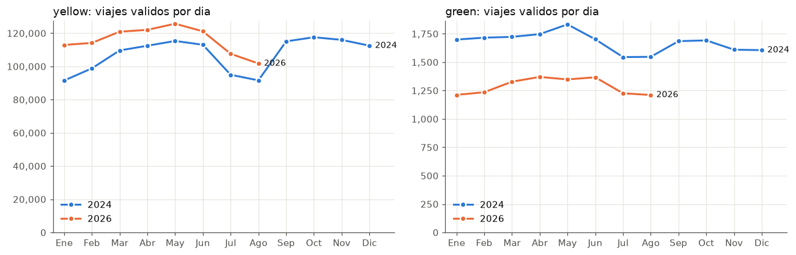

# Ejercicio 5 - Incorporación de los datos de 2024

- **Cambio al sistema de descarga:** `scripts/download_data.py` (una línea, ver 5.1).
- **Consultas de validación (5.6, 5.8):** `sql/ejercicio5/`. SQL, resultado y tiempo de cada una en [`docs/resultados/ejercicio5.md`](resultados/ejercicio5.md), generado con `python scripts/run_sql.py ejercicio5`.
- **Compatibilidad de las consultas anteriores (5.7):** `scripts/compatibilidad.py`, resumen en [`docs/resultados/ejercicio5_compatibilidad.md`](resultados/ejercicio5_compatibilidad.md). Los resultados de los Ejercicios 3 y 4 sobre 2024+2026 quedan en `docs/resultados/ejercicio5/resultados_2024_2026/`.
- **Verificación de la descarga (5.5):** [`docs/resultados/verificacion_descarga.md`](resultados/verificacion_descarga.md).
- **Notebook con la gráfica:** `notebooks/ejercicio5_incorporacion.ipynb` → `docs/figuras/e5_viajes_por_dia_2024_2026.png`.

## Orden de trabajo

El objetivo era que la comparación "antes / después" fuera justa, en la misma máquina:

1. Se descargó 2026 con el sistema tal como quedó en el Ejercicio 2 (16 archivos, enero a agosto; septiembre aún no está publicado).
2. **Línea base:** se ejecutaron las 29 consultas de los Ejercicios 3 y 4 con solo 2026 (`compatibilidad.py --etapa 2026`).
3. Se agregó 2024 a la configuración y se ejecutó de nuevo la descarga.
4. Se verificó la descarga, se ejecutaron las consultas de validación y se repitieron las 29 consultas con 2024+2026 (`--etapa 2024_2026`).

## 5.1 Modificación del sistema de descarga

El único cambio de lógica fue agregar el año a la configuración:

```python
# scripts/download_data.py
ANIOS_POR_DEFECTO = (2024, 2026)      # antes: (2026,)
```

No hizo falta más porque en el Ejercicio 2 el año ya se había convertido en un parámetro de todas las funciones (`construir_url`, `ruta_destino`, `descargar`). `verify_data.py` importa la misma constante, así que también verifica 2024 sin cambios. Se podía obtener lo mismo sin editar el código (`--anio 2024 2026`), pero se cambió la constante para que el comando por defecto reproduzca el conjunto completo del laboratorio.

**Cambio de ambiente (no de lógica).** El repositorio está en una carpeta de OneDrive, que habría subido a la nube los ~1.2 GB de Parquet y los ~2 GB de la base del Ejercicio 6. Se agregó la variable opcional `LAB8_DATA_DIR` a `docker-compose.yml` (por defecto `./data`) y un `.env` local, ignorado por Git, que apunta a una carpeta fuera de OneDrive. Dentro del contenedor la ruta sigue siendo `/workspace/data/raw/<tipo>/<anio>/`, así que ningún script cambió.

## 5.2 - 5.4 Conservar 2026, no volver a descargar y ejecutar

Resumen de la ejecución con 2024 + 2026:

```text
  anios         : 2024, 2026
  descargados   : 24        <- 12 amarillos + 12 verdes de 2024
  ya existian   : 16        <- los 16 de 2026: "ya existe, se omite"
  no publicados : 8         <- 2026-09 (aún no publicado) y 2026-10 a 12 (no han terminado)
  fallidos      : 0
```

Una segunda ejecución inmediata da `descargados: 0`, `ya existian: 40`.

**Evidencia de que 2026 se conservó sin tocarlo.** Antes de la descarga se guardó una copia de `data/raw/manifest.csv`. Al compararla con el manifiesto posterior, por archivo:

| tipo | año | en el manifiesto antes | después | mismo SHA-256, bytes y fecha de descarga | modificados |
|---|---|---|---|---|---|
| yellow | 2026 | 8 | 8 | 8 | 0 |
| green | 2026 | 8 | 8 | 8 | 0 |
| yellow | 2024 | 0 | 12 | - | - |
| green | 2024 | 0 | 12 | - | - |

La fecha de modificación de los archivos de 2026 en disco tampoco cambió.

**Cómo lo garantiza el script** (sin código nuevo, ya existía desde el Ejercicio 2):
- un archivo que existe y tiene la firma `PAR1` al inicio y al final se omite y su entrada del manifiesto no se reescribe;
- cada año se guarda en su propia carpeta, `data/raw/<tipo>/<anio>/`, así que descargar un año no puede sobrescribir otro;
- la descarga se escribe en un `.part` y solo se renombra cuando el tamaño coincide con el publicado.

**Una falla real durante el trabajo.** En la primera descarga de 2026 el DNS del contenedor falló tras 2 archivos. El script reportó 17 archivos como **fallidos** (código de salida 1), no como "no publicados". La segunda ejecución descargó solo los 14 que faltaban. Es el comportamiento que se buscaba en el Ejercicio 2, y es lo que permite volver a ejecutar el proceso sin riesgo.

## 5.5 Verificación de los archivos nuevos

`python scripts/verify_data.py` (ahora con 2024 y 2026) termina con código 0: **completo**. Cada uno de los 40 archivos publicados está descargado, su tamaño coincide byte a byte con el `Content-Length` publicado y DuckDB puede leer su footer.

| tipo | año | archivos | registros |
|---|---|---|---|
| yellow | 2024 | 12 | 41,169,720 |
| yellow | 2026 | 8 | 29,703,355 |
| green | 2024 | 12 | 660,218 |
| green | 2026 | 8 | 337,114 |
| **total** | | **40** | **71,870,407** |

En los archivos de 2024, entre el 99.94 % y el 100 % de los viajes tienen el pickup dentro del mes del archivo. Los errores de fecha son del mismo tipo que en 2026: fechas de 2002 y 2008–2009, y al menos un viaje en `yellow_tripdata_2024-06` con pickup en junio de **2026**. La regla `f_fuera_periodo` los marca sin cambios.

Las consultas 5.1 y 5.2 confirman lo mismo desde DuckDB:
- **5.1:** 12 meses en 2024 y 8 en 2026 para cada tipo, sin huecos, y cada archivo en la carpeta de su año.
- **5.2:** para cada tipo y año, la suma de `num_rows` de los footers es igual a `count(*)` sobre la vista `viajes`. La diferencia es **0**: la vista unificada no pierde ni duplica filas al juntar los dos años.

## 5.6 Consultas conjuntas de 2024 y 2026

Las vistas leen `data/raw/<tipo>/*/*.parquet`, así que, sin cambiar nada, una sola consulta devuelve ambos años.

**5.4 - Volumen, cobertura y calidad por año** (vista `viajes_enriquecidos`):

| taxi | año | meses | registros | válidos | % válidos |
|---|---|---|---|---|---|
| yellow | 2024 | 12 | 41,169,720 | 39,286,835 | 95.43 |
| yellow | 2026 | 8 | 29,703,355 | 28,127,474 | 94.69 |
| green | 2024 | 12 | 660,218 | 613,074 | 92.86 |
| green | 2026 | 8 | 337,114 | 312,777 | 92.78 |

Los conteos de 2026 son idénticos a los del Ejercicio 4, lo que muestra que agregar 2024 no alteró lo que ya existía.

**5.5 - Mismo mes, distinto año** (figura `figuras/e5_viajes_por_dia_2024_2026.png`):



- **Amarillos:** cada mes de 2026 tiene más viajes por día que el mismo mes de 2024: +23.4 % en enero y entre +7.2 % y +15.5 % el resto.
- **Verdes:** todos los meses de 2026 están entre 19.7 % y 28.7 % por debajo de 2024.
- **Estacionalidad:** la forma es la misma en ambos años. Sube hasta mayo y cae en julio–agosto. 2024 muestra que la demanda se recupera en septiembre–octubre (máximo anual de amarillos en octubre: 117,576 viajes por día), algo que con solo 2026 no se podía ver.

**5.6 - Comparación en los mismos meses (enero a agosto)**, para que la estacionalidad no sesgue la comparación:

| | Amarillos 2024 | Amarillos 2026 | Verdes 2024 | Verdes 2026 |
|---|---|---|---|---|
| Viajes válidos por día | 103,374 | 115,751 (+12.0 %) | 1,689 | 1,287 (−23.8 %) |
| Distancia mediana (mi) | 1.80 | 1.94 | 1.96 | 2.13 |
| Duración mediana (min) | 12.7 | 14.1 | 11.9 | 13.2 |
| Total mediano (USD) | 20.99 | 23.59 (+12.4 %) | 19.09 | 20.50 |
| % tarjeta | 75.9 | 65.3 | 70.6 | 76.8 |
| % efectivo | 13.8 | 9.0 | 29.0 | 22.8 |
| % Flex Fare / sin dato de pago | 9.1 | 25.0 | 4.1 | 13.6 |
| % viajes de aeropuerto | 10.28 | 9.74 | 0.28 | 0.29 |
| % con cargo CBD | 0.0 | 72.4 | 0.0 | 8.5 |

Interpretación:
- **El crecimiento de los amarillos viene de Flex Fare.** Flex Fare pasa de 9.1 % a 25.0 % de los viajes amarillos. En viajes por día, eso es aproximadamente 9,400 en 2024 y 28,900 en 2026 (×3.1). En cambio, los viajes con otros métodos de pago *bajan* de ≈ 94,000 a ≈ 86,800 por día (−8 %). Por eso la caída de la participación de la tarjeta (75.9 → 65.3 %) no significa que se use menos la tarjeta: ese bloque pasó a Flex Fare.
- **El cargo CBD explica parte del aumento de precio.** Es 0 % en 2024 porque no existía (la tarifa de congestión de Manhattan empezó en enero de 2025) y 72.4 % en 2026. El total mediano sube 12 %. Los viajes también son un poco más largos y lentos: la duración mediana sube 11 % y la distancia 8 %.
- **Los verdes pierden casi una cuarta parte de su volumen**, pero su perfil (distancia, aeropuerto, uso de efectivo) cambia poco.

**5.7 - Columnas que cambian entre años:**
- `cbd_congestion_fee` y `request_source` quedan **NULL en el 100 % de 2024**, no en 0. Así, un promedio o un `count()` sobre esas columnas no confunde "no existía" con "no se cobró".
- El patrón que el Ejercicio 3 encontró en 2026 se repite en 2024. `payment_type = 0` en amarillos y `payment_type` NULL en verdes coinciden exactamente con `passenger_count` NULL (9.94 % y 3.68 % en 2024). La decisión de tratar ese bloque como Flex Fare / sin dato sigue siendo válida.

## 5.7 ¿Hay que modificar las consultas anteriores?

**Respuesta corta: no fue necesario modificar ninguna consulta.** Las 29 consultas de los Ejercicios 3 y 4 se ejecutaron **sin cambios** sobre 2024+2026 y ninguna falló (29/29 en ambas etapas). Pero que una consulta funcione no significa que su resultado siga respondiendo la misma pregunta. Por eso se revisó cada una ([detalle](resultados/ejercicio5_compatibilidad.md)):

| Grupo | Consultas | Qué pasa con 2024+2026 | ¿Cambio? |
|---|---|---|---|
| Inventario y metadatos | 3.1, 3.2a, 3.2b, 3.4 | Se amplían solas: 3.2a pasa de 16 a 40 archivos; 3.2b da 71,870,407, igual que `verify_data.py`; 3.4 detecta sola que `cbd_congestion_fee` está en 8 de los 20 archivos de cada tipo. | No |
| Esquema | 3.3a-c | Resultado **idéntico** al de 2026. 2024 tiene las mismas columnas y tipos, menos 2 (consulta 5.3), y `union_by_name` produce el mismo esquema. | No |
| Series por mes | P1, P9, 3.6i | Ya agrupan por mes o archivo: pasan de 16 a 40 filas y 2024 aparece como meses nuevos. | No |
| Agregados de todo el período | P2-P8, P10, P11, 3.5, 3.6a-h | Funcionan, pero ahora mezclan los dos años. Ejemplo: P4 dice que el **30.2 %** de los amarillos pagó cargo CBD. Ese valor no corresponde a ningún año real: es una mezcla de 0 % (2024) y 72.4 % (2026) que depende de cuántos meses de cada año haya. | No en el Ej. 5: para comparar años se usan las consultas 5.4–5.6 con `anio_archivo`; el Ej. 8 agrega el año a los indicadores |

**Lo que sí cambió fue la infraestructura, no las consultas:**

1. **Columnas opcionales en las vistas de origen** (`sql/00_vistas.sql`). Con las vistas originales, si se leen solo los archivos de 2024 la consulta falla: `Binder Error: Referenced column "cbd_congestion_fee" not found`. Con 2024+2026 funcionaba solo porque `union_by_name` toma la columna de los archivos de 2026. Se agregó un `UNION ALL BY NAME` con una fila vacía que garantiza esas columnas (NULL cuando el archivo no las trae). Se comprobó con `EXPLAIN` que la lectura sigue aplicando la proyección de columnas y los filtros dentro de `READ_PARQUET`. Esto también permite los escenarios de 1 y 3 meses del Ejercicio 6.
2. **Restringir años sin editar SQL.** `scripts/lab.py` acepta `conectar(anios=[2026])` y `LAB8_ANIOS`, y `run_sql.py` acepta `--anio`. Las vistas leen la lista de archivos de una variable (`SET VARIABLE archivos_yellow = [...]`, `getvariable()` en la vista). Así los resultados del Ejercicio 4 siguen siendo reproducibles con `run_sql.py ejercicio4 --anio 2026`, aunque haya más años descargados. Se verificó que `viajes_validos` con `--anio 2026` da exactamente los 28,127,474 / 312,777 viajes del Ejercicio 4.
3. **Limitación conocida, sin cambio:** 3.6f, 3.6h y 3.6i leen los Parquet directamente y usan `cbd_congestion_fee` o `request_source`, que solo existen en 2026. Funcionan mientras haya archivos de 2026 descargados. Son consultas exploratorias sobre esas columnas, así que no se modificaron.

**Rendimiento: funcionan, pero no todas escalan igual.** Con 2.4 veces más filas (30.0 M → 71.9 M), el tiempo total de las 29 consultas pasa de 198 s a 540 s (×2.7). La mayoría crece en proporción a los datos (×1.5 – ×2.7). Tres consultas crecen algo más: 3.6c ×3.8, 3.6d ×3.6 y 3.6h ×3.3. Otras tres crecen mucho más que los datos:

| Consulta | 2026 | 2024+2026 | Factor | Por qué es más sensible al volumen |
|---|---|---|---|---|
| 3.6e códigos categóricos | 5.2 s | 50.0 s | ×9.6 | La CTE `t` se usa 4 veces y DuckDB la materializa (`EXPLAIN` muestra un nodo `CTE` y 4 `CTE_SCAN`): guarda una copia de las 72 M filas (antes 30 M) antes de agrupar. |
| 3.6f consistencia de montos | 3.3 s | 27.9 s | ×8.5 | Usa `median()` exacta, que necesita guardar todos los valores filtrados. |
| 3.6g duplicados | 13.3 s | 72.9 s | ×5.5 | Agrupa por 7 columnas: ~71.8 M grupos en la tabla hash, casi uno por fila. |

No hubo que cambiarlas para el Ejercicio 5. Sin embargo, son las primeras que podrían fallar por memoria al agregar 2025 (Ejercicio 8). La corrección sería la misma que ya se usó en el Ejercicio 4: `approx_quantile` en lugar de `median`, y reescribir 3.6e para leer los datos una sola vez (`UNPIVOT` o `GROUPING SETS`).

**Validación de la línea base.** En la etapa 2026, este clon reproduce lo documentado en los Ejercicios 3 y 4: 23 consultas idénticas y 1 con diferencias menores a 1 % (P3, percentiles aproximados). Las 5 restantes dan "distinto" por funciones no deterministas, no por los datos: `SUMMARIZE` y `approx_quantile` (3.6a, 3.6b, P10), orden de `string_agg(DISTINCT)` (3.6i) y empates en el corte de `ORDER BY ... LIMIT 30` (3.6d). En una primera corrida, 3.6h (`mode()` con empates) también dio "distinto"; al repetirla dio "igual". Esta comparación también confirma que separar las vistas en dos capas no cambió ningún resultado del Ejercicio 4.

## 5.8 Consultas de validación

| Id | Consulta | Objetivo | Resultado |
|---|---|---|---|
| 5.1 | `5_01_archivos_por_anio.sql` | Archivos y meses por tipo y año (solo nombres de archivo) | 12 + 8 meses por tipo, 0 huecos, 0 archivos en carpeta incorrecta |
| 5.2 | `5_02_registros_metadatos_vs_vista.sql` | Filas en los footers vs. `count(*)` sobre la vista | Diferencia 0 en los 4 grupos |
| 5.3 | `5_03_esquema_por_anio.sql` | Columnas no uniformes entre años (presencia, tipo, nombre) | Solo `cbd_congestion_fee` (no existe en 2024) y `request_source` (3 de 8 archivos de 2026); ningún tipo físico cambia |
| 5.4 | `5_04_resumen_por_anio.sql` | Consulta conjunta: volumen, fechas y % válidos por año | Ver 5.6 |
| 5.5 | `5_05_viajes_por_mes_y_anio.sql` | Viajes por día del mismo mes en distintos años | Ver 5.6 y figura |
| 5.6 | `5_06_comparacion_mismo_periodo.sql` | Métricas del Ej. 4 por año en los meses comunes | Ver 5.6 |
| 5.7 | `5_07_columnas_por_anio.sql` | Contenido de las columnas que cambian entre años | NULL en 2024, no 0 |
| 5.8 | `5_08_calidad_por_anio.sql` | Reglas de calidad del Ej. 3 aplicadas a cada año | Ver abajo |
| 5.9 | `5_09_desglose_duracion.sql` | Explicar la diferencia de la regla de duración entre años | Ver abajo |

**Las reglas de calidad definidas con 2026 sirven para 2024, pero cada año falla de forma distinta (5.8, 5.9).** El total excluido es parecido: amarillos 4.57 % en 2024 y 5.31 % en 2026; verdes 7.14 % y 7.22 %. La composición, en cambio, es muy diferente:

| % de registros amarillos marcados por regla | 2024 | 2026 |
|---|---|---|
| Duración ≤ 0 o > 6 h | 0.09 | 1.28 |
| Distancia ≤ 0 o > 100 mi | 1.89 | 3.21 |
| Tarifa o total ≤ 0 | 1.82 | 0.61 |
| Pasajeros = 0 | 0.98 | 0.31 |

La regla de duración marca 15 veces más en 2026. Según 5.9, la causa es casi por completo **un proveedor nuevo**. El proveedor 7 (Helix, identificado en el Ejercicio 3) tiene 367,120 viajes en 2026, todos con duración **exactamente 0**, aunque el 98 % tiene distancia mayor que 0. En 2024 casi no existía (230 viajes). Sin ese proveedor, la regla marcaría ~0.04 % de 2026, incluso menos que el 0.09 % de 2024. No es un cambio en los viajes, sino en cómo un proveedor registra la hora de llegada. Además:
- en 2024 hay más montos ≤ 0 y más viajes con 0 pasajeros;
- los 32,794 duplicados de 2026 (3.6g) casi no tienen equivalente en 2024: los duplicados del conjunto completo son 32,801, así que 2024 aporta solo 7.

Conclusión: los umbrales no se cambian. Sin embargo, al agregar un año hay que revisar qué regla marca cada registro, no solo el porcentaje total.

## 5.9 ¿Qué características del diseño permiten incorporar archivos sin rehacer el flujo?

1. **El año es configuración, no código.** El script recibe los años como parámetro (`ANIOS_POR_DEFECTO` o `--anio`), y descarga y verificación comparten la misma constante. Incorporar 2024 fue cambiar una línea; para 2025 (Ejercicio 8) será lo mismo.
2. **La descarga es idempotente.** Omite los archivos válidos, valida cada descarga contra el tamaño publicado y la firma `PAR1`, escribe sobre `.part` antes de renombrar y registra todo en el manifiesto. Se puede ejecutar cualquier cantidad de veces: solo hace lo que falta y nunca toca lo que ya está bien.
3. **Convención de carpetas + comodines.** Los archivos van en `data/raw/<tipo>/<anio>/` y las vistas leen `data/raw/<tipo>/*/*.parquet`. Un archivo nuevo en esa estructura entra al análisis sin editar nada (*schema-on-read*: no hay paso de importación que repetir).
4. **El esquema se resuelve por nombre, no por posición.** `union_by_name`, `TRY_CAST` a tipos homogéneos y las columnas opcionales de la vista absorben columnas que aparecen o desaparecen entre años, y lo que no existía queda como NULL.
5. **El año y el mes se derivan del nombre del archivo** (`anio_archivo`, `mes_archivo`). Ninguna consulta ni regla de calidad tiene un año escrito. `f_fuera_periodo` compara cada viaje con el mes de *su* archivo, sea cual sea el año.
6. **Las consultas dependen de vistas, no de rutas.** Hay una capa de origen (`00_vistas.sql`) y una de análisis (`02_vistas_analisis.sql`). Cuando cambian los archivos o su almacenamiento (Ejercicio 6), solo cambia la capa de origen.
7. **La verificación también se puede repetir.** `verify_data.py` y `compatibilidad.py` comprueban cada incorporación contra la fuente y contra los resultados anteriores. Funcionan como pruebas de regresión del flujo.
8. **Los resultados anteriores siguen siendo reproducibles.** `--anio`, `LAB8_ANIOS` y `SET VARIABLE` permiten volver a calcular un resultado histórico, como el Ejercicio 4 con 2026, sin borrar datos.

Lo que este diseño **no** resuelve solo: si la TLC renombra una columna o cambia el significado de un código (por ejemplo, un nuevo `payment_type`), hay que actualizar el mapeo en la vista `viajes`. Y si la pregunta es comparar años, hay que agregar el año a la consulta. La infraestructura ayuda a detectar estos casos (5.3, 5.7, 5.9), pero no los decide.
