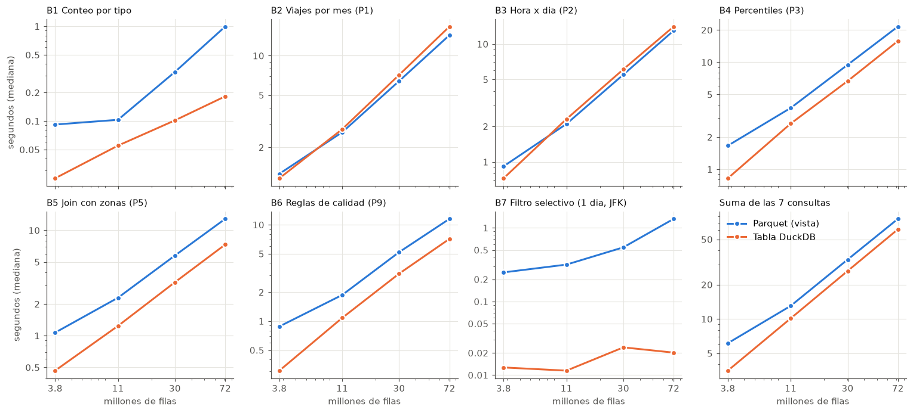
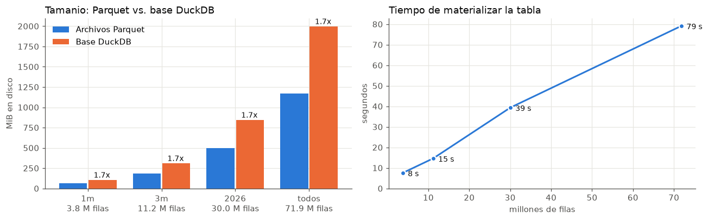

# Ejercicio 6 - Parquet versus tablas DuckDB

- **Tabla materializada (6.2):** `scripts/materializar.py` → `data/processed/taxis.duckdb`.
- **Benchmark (6.4–6.7):** `scripts/benchmark.py`. Tablas completas, ambiente y SQL de cada consulta en [`docs/resultados/ejercicio6.md`](resultados/ejercicio6.md); datos crudos en `docs/resultados/ejercicio6/` (`tiempos.csv`: 224 ejecuciones; `resumen.csv`; `materializacion.csv`; `validez.csv`).
- **Perfil de operadores (6.9):** `scripts/perfilar.py` → [`docs/resultados/ejercicio6/perfil.md`](resultados/ejercicio6/perfil.md).
- **Figuras:** `notebooks/ejercicio6_benchmark.ipynb` → `docs/figuras/e6_*.png`.
- **Consultas nuevas:** `sql/ejercicio6/`. Las demás se reutilizan tal cual de `sql/ejercicio4/`.

## Diseño del experimento

Para que la comparación sea válida, ambos modos ejecutan **los mismos archivos `.sql`**, sin copiarlos ni adaptarlos. Lo único que cambia es qué es la relación `viajes`:

```text
                                  ┌─ modo parquet: viajes = VISTA (sql/00_vistas.sql)
 consulta .sql  →  viajes_validos ┤      → read_parquet(archivos del escenario) en cada consulta
 (sql/ejercicio4,  viajes_enriq.  │
  sql/ejercicio6)  (02_vistas_    └─ modo tabla:   viajes = TABLA en data/processed/benchmark/<esc>.duckdb
                    analisis.sql)        (copia de esa misma vista, abierta en solo lectura)
```

Para lograrlo se separaron las vistas en dos capas. La capa de origen (`00_vistas.sql`) es la única que sabe dónde están los datos. La capa de análisis (`02_vistas_analisis.sql`), con las columnas derivadas y las reglas de calidad, solo depende de `viajes`, así que funciona igual sobre la vista o sobre la tabla. La base materializada incluye esas mismas vistas.

**Protocolo de medición:**
- **Ejecuciones:** cada consulta se ejecuta en una **conexión nueva** por modo. Se registra la primera ejecución y luego **3 repeticiones**, y se reporta la mediana de las repeticiones. En total son 224 ejecuciones (4 escenarios × 7 consultas × 2 modos × 4).
- **Validez:** el script compara el resultado de ambos modos. Coinciden exactamente en 24 de 28 casos. En los 4 de B4 la diferencia es menor a 1 %, porque usa `approx_quantile`.
- **Ambiente:** DuckDB 1.5.5 en Docker Desktop (WSL2) sobre Windows, 8 hilos y `memory_limit` de 3.5 GiB, que es el 60 % de lo disponible según `scripts/lab.py`. Los datos están en una carpeta de Windows montada en el contenedor.
- **Limitaciones:**
  - no se puede vaciar la caché de archivos del sistema operativo dentro del contenedor, así que la "primera ejecución" no es una lectura en frío desde disco;
  - la dispersión mediana entre repeticiones fue de 9–15 % (máximo menos mínimo, sobre la mediana), así que una diferencia menor que eso en un solo caso no es concluyente.

## 6.1 Consultar directamente los archivos Parquet

Es el modo que usaron los Ejercicios 3 a 5. Las vistas leen los archivos en cada consulta:

```sql
CREATE OR REPLACE VIEW yellow_raw AS
SELECT * FROM read_parquet(coalesce(getvariable('archivos_yellow'),
                                    ['data/raw/yellow/*/*.parquet']),
                           union_by_name = true, filename = true)
UNION ALL BY NAME
SELECT NULL::DOUBLE AS cbd_congestion_fee, NULL::VARCHAR AS request_source WHERE false;
```

Para cada escenario del benchmark, `scripts/lab.py:fijar_archivos()` ejecuta `SET VARIABLE archivos_yellow = [...]` con la lista exacta de archivos. Así las mismas vistas leen 1, 3, 8 o 20 meses sin editar el SQL.

## 6.2 Tabla DuckDB con los años descargados

```bash
docker compose exec lab python scripts/materializar.py
```

El script abre una conexión con las vistas sobre Parquet, adjunta la base destino y copia la vista unificada:

```sql
ATTACH 'data/processed/taxis.duckdb' AS mat;
CREATE TABLE mat.viajes AS SELECT * FROM viajes;          -- 2024 + 2026, esquema unificado
CREATE TABLE mat.zonas  AS SELECT * FROM zonas;
CREATE TABLE mat.origen AS SELECT archivo, taxi, anio, mes, count(*) ... -- trazabilidad
-- y dentro de la base: sql/02_vistas_analisis.sql (viajes_enriquecidos, viajes_validos)
```

| | Parquet (40 archivos) | `taxis.duckdb` |
|---|---|---|
| Filas | 71,870,407 | 71,870,407 |
| Tamaño | 1,172 MiB | 1,995 MiB (×1.7) |
| Compresión | ZSTD (propósito general, alta razón) | BitPacking, ALP, Dictionary, RLE, Constant, FSST (ligera, rápida de recorrer) |
| Tiempo de creación | - | 79 s (`CREATE TABLE`: 75 s) |

Se comprobó que `viajes_validos` sobre la tabla da los mismos 67,414,309 viajes amarillos y 925,851 verdes que sobre Parquet. La tabla `origen` registra de qué archivos vienen las filas. Es importante porque, a diferencia de la vista, **la tabla es una copia**: no incluye archivos descargados después de crearla.

## 6.3 Consultas representativas

Se eligieron 7 consultas que cubren los tipos de operación del análisis anterior:

| Id | Consulta | Origen | Tipo de operación | Por qué es representativa |
|---|---|---|---|---|
| B1 | Conteo por tipo | `6_01` (equivale a 3.2b) | Recorrido mínimo, sin columnas de datos | Mide el costo fijo de abrir y recorrer el origen |
| B2 | Viajes por mes | P1 `4_01` | Agregación + `count(DISTINCT)` + ventana | Serie temporal, base de cualquier tablero |
| B3 | Hora × día | P2 `4_02` | Agregación con 336 grupos + ventana | Funciones de fecha sobre todas las filas |
| B4 | Percentiles | P3 `4_03` | `approx_quantile` sobre 4 variables | Cálculo intensivo |
| B5 | Origen por borough | P5 `4_05` | `JOIN` con `zonas` + agregación | El único *join* del análisis |
| B6 | Reglas de calidad | P9 `4_09` | Muchas agregaciones `FILTER` sobre todas las filas | Recorrido completo sin filtro |
| B7 | Un día en JFK | `6_02` | Filtro muy selectivo (< 0.01 % de las filas) | Consulta puntual o de tablero con filtros |

## 6.4 - 6.7 Resultados

Escenarios de volumen (6.6). Todos incluyen enero de 2026, que usa B7:

| Escenario | Meses | Archivos | Filas | Parquet | Tabla DuckDB | Crear la tabla |
|---|---|---|---|---|---|---|
| `1m` | 2026-01 | 2 | 3,765,161 | 62 MiB | 103 MiB | 7.6 s |
| `3m` | 2026-01 a 03 | 6 | 11,199,059 | 185 MiB | 308 MiB | 14.7 s |
| `2026` | 2026-01 a 08 | 16 | 30,040,469 | 496 MiB | 843 MiB | 39.4 s |
| `todos` | 2024 + 2026 | 40 | 71,870,407 | 1,172 MiB | 1,995 MiB | 79.2 s |

**Tiempo por consulta** (mediana de 3 repeticiones, segundos; **×** = Parquet / tabla, > 1 significa que la tabla es más rápida):

| Consulta | 1m Parquet | 1m Tabla | × | 3m × | 2026 × | todos Parquet | todos Tabla | × |
|---|---|---|---|---|---|---|---|---|
| B1 Conteo | 0.092 | 0.025 | 3.7 | 1.9 | 3.2 | 0.995 | 0.182 | 5.5 |
| B2 Viajes por mes | 1.254 | 1.159 | 1.1 | 0.9 | 0.9 | 14.354 | 16.706 | **0.9** |
| B3 Hora × día | 0.918 | 0.726 | 1.3 | 0.9 | 0.9 | 12.993 | 14.071 | **0.9** |
| B4 Percentiles | 1.661 | 0.824 | 2.0 | 1.4 | 1.4 | 21.546 | 15.781 | 1.4 |
| B5 Join con zonas | 1.069 | 0.466 | 2.3 | 1.9 | 1.8 | 12.839 | 7.323 | 1.8 |
| B6 Reglas de calidad | 0.881 | 0.306 | 2.9 | 1.7 | 1.7 | 11.509 | 7.136 | 1.6 |
| B7 Un día en JFK | 0.248 | 0.013 | 19.6 | 27.6 | 22.9 | 1.325 | 0.020 | **65.6** |
| **Suma de las 7** | 6.12 | 3.52 | 1.7 | 1.3 | 1.3 | 75.56 | 61.22 | 1.2 |



**Primera ejecución en una conexión nueva:** la ventaja de la tabla es menor. Con todos los datos, B4–B6 quedan en ×1.2 en lugar de ×1.4–1.8, y B7 en ×9.6 en lugar de ×65.6. La primera vez, la tabla también tiene que leer sus bloques del archivo; en las repeticiones ya están en la caché de DuckDB (*buffer pool*) (detalle en el reporte).

**Costo de materializar y punto de equilibrio:**



| Escenario | Materializar | Ahorro por ronda de 7 consultas | Rondas para amortizar |
|---|---|---|---|
| 1m | 7.6 s | 2.6 s | 2.9 |
| 3m | 14.7 s | 2.9 s | 5.0 |
| 2026 | 39.4 s | 6.8 s | 5.8 |
| todos | 79.2 s | 14.3 s | 5.5 |

## 6.8 Consultas del benchmark

El SQL completo de las 7 consultas está en [`docs/resultados/ejercicio6.md`](resultados/ejercicio6.md#consultas-del-benchmark). B1 y B7 están en `sql/ejercicio6/` y B2–B6 son los archivos del Ejercicio 4 sin modificar. El SQL de la materialización está en `scripts/materializar.py`.

## 6.9 Análisis de los resultados

**1. La tabla ahorra el costo de leer y decodificar, no el de calcular.** El perfil de operadores (`perfilar.py`, todos los datos) muestra dónde se va el tiempo:

| Consulta | Modo | CPU total | Lectura de datos | Filtro + proyección (reglas de calidad, columnas derivadas) |
|---|---|---|---|---|
| B5 | Parquet | 104 s | 45 % | 44 % |
| B5 | Tabla | 59 s | 7 % | 74 % |
| B6 | Parquet | 85 s | 47 % | 47 % |
| B6 | Tabla | 64 s | 12 % | 71 % |

Leer Parquet cuesta casi la mitad del tiempo, y no solo por la lectura del disco:
- hay que descomprimir ZSTD;
- hay que decodificar las páginas al formato de vectores de DuckDB;
- se abren 40 archivos y se leen sus metadatos en cada consulta;
- en esta vista, además, `anio_archivo`/`mes_archivo` se calculan con una expresión regular sobre el nombre del archivo, mientras que en la tabla ya están guardados.

La tabla ya está en el formato nativo, con compresión ligera, y en las repeticiones sus bloques están en la caché de DuckDB. Por eso la lectura baja a 7–12 %. Lo que **no** cambia entre modos es el cálculo: las banderas de calidad, `date_trunc`, `isodow` y las tablas hash. Ese cálculo pasa a dominar el tiempo con la tabla (70–75 %) y limita la ganancia a ×1.4–1.8 en los recorridos completos (B4, B5, B6).

**2. La gran diferencia está en las consultas selectivas (B7: ×20 a ×66).**
- **Con Parquet**, aunque solo importa un día, DuckDB debe abrir **todos** los archivos y leer los metadatos y las estadísticas de sus *row groups* para descartarlos. Por eso el tiempo crece con la cantidad de archivos (0.25 s con 2 archivos y 1.3 s con 40), aunque el resultado sea el mismo.
- **Con la tabla**, las estadísticas min/max de cada bloque (*zone maps*) ya están en memoria, así que B7 tarda **~0.02 s sin importar el volumen**.

B1 se comporta parecido (×1.9 a ×5.5): casi todo su costo es fijo por archivo.

**3. B2 y B3 son un poco más lentas con la tabla (×0.9), y no es ruido.** La diferencia es de 5–16 %, cerca de la dispersión entre repeticiones. Sin embargo, aparece en los tres escenarios grandes, también en la primera ejecución, y el plan físico explica por qué:

| | Parquet | Tabla |
|---|---|---|
| B3: operadores en el plan | 1 lectura, 1 `FILTER`, `WINDOW` | **2** lecturas (`SEQ_SCAN`), **2** `FILTER`, `HASH_JOIN` |
| B3: tiempo de CPU del filtro | ~36 s | ~73 s |

Con la tabla, el optimizador conoce estadísticas exactas que no tiene sobre la vista de Parquet. Con ellas elige reescribir la ventana `sum(count(*)) OVER (PARTITION BY ...)` como un *join* entre dos agregaciones. Eso recorre y filtra `viajes` **dos veces**: cada lectura es más barata, pero hay el doble de filtro. B5 también tiene una ventana, pero el optimizador la conservó, y ahí la tabla gana ×1.8. Lección: **materializar cambia también la información que usa el optimizador**, y el plan resultante no siempre es mejor. Solo midiendo se ve.

**4. Cómo cambia el comportamiento con el volumen (6.6).**
- **Recorridos completos:** en ambos modos el tiempo crece casi en proporción a las filas. En la figura la pendiente es ≈ 1 en escala log-log: B6 tarda ×13 con Parquet y ×23 con la tabla para ×19 filas.
- **La ventaja relativa de la tabla en recorridos completos baja con el volumen.** B6 pasa de ×2.9 con 1 mes a ×1.6 con 72 M filas, y la suma de las 7 consultas de ×1.7 a ×1.2. Con pocos datos pesan los costos fijos de Parquet (abrir archivos, leer metadatos, preparar la decodificación). Con muchos datos domina el cálculo por fila, que es igual en ambos modos.
- **En consultas selectivas la ventaja crece con el volumen** (B7 de ×20 a ×66), porque el costo de Parquet aumenta con la cantidad de archivos y el de la tabla no.
- **El costo de materializar crece de forma lineal**, ~1.1 s por millón de filas, y la base ocupa siempre ×1.7 el tamaño del Parquet.

**5. ¿Cuándo se recupera el costo de materializar?** Con todos los datos, materializar cuesta 79 s y cada ejecución de las 7 consultas ahorra 14 s. Se recupera después de **~5.5 rondas**, y lo mismo pasa en los demás escenarios (3 a 6 rondas). Para un análisis que se repite (exploración iterativa, un tablero que se refresca) la tabla conviene. Para una consulta única, no.

## 6.10 ¿Cuándo consultar Parquet y cuándo materializar?

**Consultar directamente los Parquet conviene cuando:**
- **Los datos llegan de forma incremental.** Un archivo nuevo en `data/raw/<tipo>/<anio>/` entra al análisis sin hacer nada (Ejercicio 5). La tabla, en cambio, queda desactualizada hasta volver a materializarla (79 s) o insertar los archivos nuevos.
- **Las consultas son pocas o se ejecutan una sola vez:** exploración inicial (Ejercicio 3), una verificación, un análisis de ida y vuelta. Con menos de ~5 rondas, materializar cuesta más de lo que ahorra.
- **Las consultas son recorridos completos con mucho cálculo** (B2–B4, B6). La tabla solo gana ×0.9–1.8, porque el cuello de botella es el cálculo y no la lectura.
- **Importa el espacio o compartir los datos.** El Parquet ocupa 1.7 veces menos, es inmutable, lo pueden leer otras herramientas (pandas, Spark, Metabase) y es la fuente de verdad reproducible que descarga el script.

**Materializar una tabla DuckDB conviene cuando:**
- **El mismo conjunto se consulta muchas veces:** tableros e indicadores (Ejercicio 7), análisis iterativo. Desde ~6 rondas la tabla ya pagó su costo.
- **Hay consultas selectivas o interactivas**, con filtros por fecha, zona o proveedor. La tabla responde en ~20 ms en lugar de ~1.3 s (×66) y su tiempo no crece con el volumen. Es lo que necesita un tablero con filtros.
- **Se necesita una foto fija y trazable de los datos:** varios lectores con `read_only` y una tabla `origen` que dice exactamente qué archivos contiene.
- **Hay que corregir, borrar o indexar datos**, cosa que un Parquet inmutable no permite.

**Recomendación para este proyecto: un esquema híbrido.**
- Los Parquet de `data/raw/` son la fuente de verdad: se descargan de forma incremental y reproducible, y sobre ellos se exploran los datos nuevos.
- `data/processed/taxis.duckdb` es una capa derivada para consultar rápido. Es la indicada para el tablero del Ejercicio 7, conectándose en modo `read_only`, y se reconstruye con `materializar.py` cuando llegan archivos nuevos.
- Como las consultas solo dependen de `viajes`, pasar de una capa a otra no requiere reescribirlas. Ese fue el objetivo de separar las vistas.
- Con los perfiles de este ejercicio, la siguiente mejora sería materializar también las columnas derivadas y las banderas de calidad (`viajes_enriquecidos`). Con la tabla, ese cálculo es el 70–75 % del tiempo de las consultas, y pagarlo una sola vez al materializar beneficiaría a todas.
