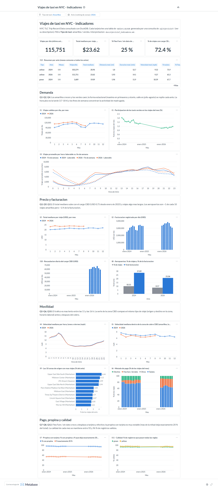

# Ejercicio 7 - Construcción de indicadores y visualización

- **Consultas de los indicadores:** `sql/ejercicio7/` (una por indicador; el encabezado de cada archivo tiene pregunta, indicador, justificación, visualización, fuente y tabla destino).
- **SQL + resultado + tiempo de cada consulta (7.7):** [`docs/resultados/ejercicio7.md`](resultados/ejercicio7.md) y un CSV por indicador en `docs/resultados/ejercicio7/`.
- **Tablero (7.4, 7.5):** Metabase, la herramienta del ambiente del laboratorio. Lo construye `scripts/tablero_metabase.py` por la API de Metabase (no se armó a mano).
- **Evidencia del tablero:** [`figuras/e7_tablero_metabase.png`](figuras/e7_tablero_metabase.png) (filtro amarillos) y [`figuras/e7_tablero_metabase_verdes.png`](figuras/e7_tablero_metabase_verdes.png) (filtro verdes).
- **Datos:** 2024 (12 meses) y 2026 (enero a agosto, el último mes publicado), amarillos y verdes: 71.9 M de registros, 68.4 M válidos. La incorporación de 2025 y la evolución de los tres años están en el [Ejercicio 8](ejercicio8_2025.md).

## Arquitectura: de los Parquet al tablero

```text
data/raw/<tipo>/<anio>/*.parquet
   │  vistas viajes → viajes_enriquecidos → viajes_validos   (sql/00, 01, 02)
   ▼
sql/ejercicio7/7_XX_*.sql            12 consultas de indicadores (DuckDB)
   │  python scripts/run_sql.py ejercicio7 --tablero
   ├─► docs/resultados/ejercicio7.md + CSV             documentación (7.7)
   └─► data/processed/tablero.duckdb                    tablas ind_* (5.8 MB)
          │  python scripts/tablero_metabase.py         (API de Metabase)
          ▼
       Metabase: colección "Lab 8 - Indicadores", tablero de 23 tarjetas
```

**Por qué Metabase no consulta los viajes directamente.** Cada tarjeta lee una tabla de agregados (16 a 192 filas) guardada en `tablero.duckdb`. Así el tablero carga al instante y Metabase no compite por memoria con DuckDB. Si cada tarjeta recorriera los 68 millones de viajes, cada visita al tablero ejecutaría 18 consultas de 15–50 s. Es la conclusión práctica del Ejercicio 6: materializar lo que se consulta muchas veces. Lo que se materializa aquí es el resultado del indicador, no la tabla de viajes. Para que el tablero no quede desconectado del SQL:

- cada tabla `ind_*` sale **sin cambios** del resultado de una consulta de `sql/ejercicio7/` (la columna `@tabla` del encabezado indica cuál);
- la descripción de cada tarjeta en Metabase nombra la consulta que la respalda;
- la tabla `indicadores` de `tablero.duckdb` registra, por tabla, la consulta, los años y la fecha de generación.

**Cambios al código:**
- `scripts/run_sql.py` recibe `--tablero`, que guarda el resultado de cada consulta con `@tabla` en `data/processed/tablero.duckdb`, y `--salida`, que permite guardar la documentación con otro nombre (se usa en el Ejercicio 8). Los encabezados `@indicador` y `@visualizacion` se agregan a la documentación generada.
- `scripts/tablero_metabase.py` (nuevo) configura Metabase si es la primera vez, registra `tablero.duckdb` **en solo lectura** (la recomendación del README para herramientas externas) y crea la colección, las tarjetas, los filtros y el tablero. Volver a ejecutarlo archiva la versión anterior y crea una nueva, así que el tablero siempre corresponde al código del repositorio.

**Comandos:**

```bash
docker compose stop metabase                                   # libera memoria mientras se calcula
docker compose exec lab python scripts/run_sql.py ejercicio7 --anio 2024 2026 --tablero
docker compose start metabase
docker compose exec lab python scripts/tablero_metabase.py --url http://metabase:3000
# -> http://localhost:3000/dashboard/<id>  (usuario admin@lab8.local, ver --help)
```

`--anio 2024 2026` reproduce exactamente estos resultados aunque 2025 ya esté descargado. Sin `--anio` se usan todos los años (Ejercicio 8).

## 7.1 Preguntas de análisis

| Id | Pregunta | Indicador |
|---|---|---|
| Q1 | ¿Cómo evoluciona la demanda diaria de cada tipo de taxi mes a mes? | I1 |
| Q2 | ¿Qué peso tienen los taxis verdes dentro del sistema y está cambiando? | I1 |
| Q3 | ¿Cuánto paga un pasajero en un viaje típico, cuánto factura el sistema por día y cómo cambia? | I2 |
| Q4 | ¿En qué horas se concentra la demanda en días laborables frente a fines de semana? | I3 |
| Q5 | ¿A qué horas es más lento el tráfico y cuánto cambia la duración de un viaje? | I4 |
| Q6 | ¿Cambió la velocidad de los viajes dentro de la zona de cobro por congestión (CBD) después de que empezó el cobro? | I5 |
| Q7 | ¿Cómo pagan los pasajeros y qué tan rápido crece Flex Fare / sin dato? | I6 |
| Q8 | ¿Cuánto dejan de propina quienes pagan con tarjeta y es estable? | I7 |
| Q9 | ¿Qué proporción de viajes y de facturación corresponde a los aeropuertos? | I8 |
| Q10 | ¿Dónde se concentra la demanda: qué zonas generan más viajes? | I9 |
| Q11 | ¿Qué parte de los viajes paga el cargo CBD y cuánto recauda por día? | I10 |
| Q12 | ¿Qué tan confiables son los datos de cada mes y qué problema de calidad pesa más? | I11 |
| Q13 | ¿Cómo se comparan los años en los mismos meses, sin sesgo estacional? | I12 |

Se plantearon 13 preguntas, respondidas con 12 indicadores (I1 responde Q1 y Q2). Cubren cinco temas: **demanda** (Q1, Q2, Q4, Q10), **precio** (Q3, Q9, Q11), **movilidad** (Q5, Q6), **pago** (Q7, Q8) y **confianza en los datos** (Q12, Q13).

## 7.2 - 7.3 y 7.6 - 7.7 Diseño, justificación y consultas

Reglas comunes a todos los indicadores:

- **Fuente:** las vistas `viajes_validos` (o `viajes_enriquecidos` para calidad) y `zonas`. Ninguna consulta lee rutas de archivos, así que todas funcionan con 2025 sin cambios (Ejercicio 8).
- **El año es una dimensión desde el principio.** El Ejercicio 5 (5.7) mostró que un agregado sobre todo el período mezcla años (por ejemplo, "30.2 % paga cargo CBD", un valor que no corresponde a ningún año real). Por eso cada indicador agrupa por `taxi` y `anio_archivo`, y los mensuales también por `mes_archivo`.
- **Medianas con `approx_quantile`** (T-Digest): memoria constante con decenas de millones de filas (Ejercicio 4). Los totales son asimétricos, así que se reporta la mediana y no el promedio.
- **Tasas por día** y no totales del mes, porque los meses tienen distinta cantidad de días.

| Ind. | Consulta | Tabla | Qué mide | Por qué se eligió | Visualización |
|---|---|---|---|---|---|
| I1 | `7_01_demanda_diaria.sql` | `ind_demanda` | Viajes válidos por día y % del mes por tipo | Medida básica de actividad. La participación mide si los verdes ganan o pierden mercado | Líneas por mes, una serie por año; línea de % de verdes |
| I2 | `7_02_costo_y_facturacion.sql` | `ind_costo` | Total mediano, total promedio, facturación por día, tarifa por milla | El total es la variable de negocio. La tarifa por milla separa precio de distancia | Líneas por mes; barras de facturación diaria |
| I3 | `7_03_perfil_horario.sql` | `ind_perfil_horario` | Viajes promedio por hora en un día laborable / de fin de semana | Dimensiona la oferta por hora. Se divide entre los días de cada tipo, que no son la misma cantidad | Líneas por hora, color por año y línea punteada en fin de semana |
| I4 | `7_04_velocidad_por_hora.sql` | `ind_velocidad_hora` | Velocidad mediana y minutos por milla, lunes a viernes | Indicador indirecto de congestión, traducido a tiempo para el pasajero | Líneas por hora, una serie por año |
| I5 | `7_05_velocidad_zona_congestion.sql` | `ind_velocidad_cbd` | Velocidad mediana de viajes amarillos con origen y destino en la zona CBD, lun-vie 7-19 h | Es la pregunta de política pública que estos datos pueden responder. Compara el mismo tipo de viaje entre años | Líneas por mes, una serie por año |
| I6 | `7_06_metodo_pago.sql` | `ind_pago` | % de viajes por método de pago | Condiciona qué propinas se registran y explica el crecimiento de los amarillos (Ej. 5) | Barras apiladas por mes |
| I7 | `7_07_propina.sql` | `ind_propina` | % con propina, % que deja exactamente 20 %, mediana | Mide la propina como la calcula la pantalla (Ej. 4, P11). Solo tarjeta y proveedor 2, cuyos totales son consistentes | Líneas por mes |
| I8 | `7_08_aeropuertos.sql` | `ind_aeropuertos` | % de viajes y % de facturación por aeropuerto | Pocos viajes con mucho peso económico. Usa `zonas`, no `airport_fee`, que solo existe en amarillos | Barras por año |
| I9 | `7_09_zonas_origen.sql` | `ind_zonas_origen` | Top 10 de zonas de origen y % acumulado | Ubica la demanda y mide su concentración | Barras horizontales (filtros tipo y año) |
| I10 | `7_10_cargo_congestion.sql` | `ind_cbd` | % con cargo CBD, cargo promedio, recaudación diaria | Principal cambio regulatorio del período. En 2024 queda NULL, no 0 | Barras por mes + tarjeta KPI |
| I11 | `7_11_calidad.sql` | `ind_calidad` | % de registros válidos y % por regla | Todos los demás usan `viajes_validos`. Si la exclusión varía, un cambio en otro indicador podría ser de captura | Líneas por mes, una por tipo |
| I12 | `7_12_resumen_anual.sql` | `ind_resumen_anual` | Resumen por año en los meses comunes | Comparar años sin sesgo estacional. Los meses comunes se calculan con los datos | Tabla + 4 tarjetas KPI |

**Dos decisiones de diseño que vale la pena explicar:**

- **I5 y la zona CBD.** El catálogo de zonas de la TLC no indica qué zonas están dentro de la zona de cobro. Se identifican con los propios datos: todo viaje que **empieza** dentro de la zona paga `cbd_congestion_fee`, mientras que uno que empieza fuera solo lo paga si entra. La consulta toma las zonas de origen donde ≥ 90 % de los viajes amarillos desde 2025 paga el cargo. El resultado separa muy bien los dos grupos: **38 zonas**, todas de Manhattan al sur de la calle 60, con entre 90.4 % y 99.2 %. La siguiente zona baja a 64 % (zona desconocida 264), seguida de Central Park (60 %), Lincoln Square East (59 %) y Upper East Side South (53 %), que están justo al norte del límite. Es la definición oficial de la zona (Manhattan al sur de la calle 60), obtenida sin escribir una lista a mano.
- **I3 y la memoria.** La primera versión usaba dos veces una CTE sobre los viajes. DuckDB la materializaba completa (70 M filas) y se quedaba sin memoria, el mismo caso que la consulta 3.6e del Ejercicio 5. La versión final agrega primero por fecha y hora (unas 70 mil filas) y calcula todo a partir de esa tabla pequeña.

El SQL completo, el resultado y el tiempo de cada consulta están en [`resultados/ejercicio7.md`](resultados/ejercicio7.md). Las 12 consultas tardan **4 min** en total sobre 71.9 M de registros (14–50 s cada una; la más lenta es I12, porque calcula los meses comunes y 4 medianas).

## 7.4 - 7.5 Tablero



Organización (de arriba hacia abajo), pensada para leerse como un informe:

1. **Encabezado y filtros.** *Tipo de taxi* (amarillos / verdes) controla casi todas las tarjetas. *Año* controla el ranking de zonas.
2. **KPI del último año** en los meses comunes (I12): viajes por día, total mediano, % Flex Fare y % con cargo CBD. Debajo, la tabla de I12 con todos los años y tipos.
3. **Demanda:** I1 (viajes por día y participación de los verdes) e I3 (perfil horario).
4. **Precio y facturación:** I2, I10 e I8.
5. **Movilidad:** I4, I5 e I9.
6. **Pago, propina y calidad:** I6, I7 e I11.

Cada sección empieza con un texto que resume qué preguntas responde y qué se observa. Decisiones de visualización:
- **Un solo eje Y por gráfica.** Cuando dos medidas tienen escalas distintas, van en tarjetas separadas.
- **Cada año conserva su color en todas las tarjetas** (2024 azul, 2025 verde agua, 2026 naranja). La paleta pasa una validación de separación con daltonismo.
- Las series por año usan el **mes en el eje x**, así se compara el mismo mes de distintos años sin que la estacionalidad confunda.

## 7.8 Resultados e interpretación

Las cifras son de `docs/resultados/ejercicio7/` (2024 completo, 2026 enero–agosto). Cuando se compara entre años se usan los mismos meses (enero–agosto), salvo que se indique lo contrario.

**I1 - Demanda (Q1, Q2).** En enero–agosto, los amarillos pasan de 103,374 viajes por día en 2024 a 115,751 en 2026 (+12.0 %). Los verdes bajan de 1,689 a 1,287 (−23.8 %). Las cifras coinciden con las del Ejercicio 5, que usó otra consulta. La forma estacional es la misma en ambos años: sube hasta mayo, cae en julio–agosto y, según 2024, se recupera en septiembre–octubre (máximo de 117,576 amarillos por día en octubre). Los verdes pasaron de 1.82 % de los viajes en enero de 2024 a 1.06 % en enero de 2026. Siempre ganan algo de participación en verano, porque los amarillos caen más en esos meses.

**I2 - Costo (Q3).** El total mediano de los amarillos sube de 20.94 a 23.61 USD (+12.8 %, promedio de enero–agosto), pero la tarifa base por milla casi no cambia: 7.25 contra 7.55 USD (+4 %). El aumento del total se explica por el cargo CBD (0.75 USD en el 72 % de los viajes) y por viajes un poco más largos (distancia mediana 1.80 → 1.93 mi), más que por la tarifa. Con más viajes y viajes más caros, la facturación registrada de los amarillos sube de 2.93 a 3.50 millones de USD por día (+19.5 %). En los verdes baja de 40.1 mil a 32.6 mil USD (−18.6 %).

**I3 - Perfil horario (Q4).** Los días laborables tienen dos subidas, a las 7–9 h y a las 17–18 h; el máximo es a las 18 h (8,004 viajes en esa hora en 2024). El fin de semana no tiene pico de mañana, pero la medianoche concentra el 13–14 % de los viajes de los amarillos entre las 0 y las 2 h, contra el 3–4 % en un día laborable. Al comparar años aparece un patrón que el Ejercicio 4 no podía ver: **el crecimiento de 2026 no ocurre en las horas pico.** De lunes a viernes, las horas de 16 a 19 h tienen *menos* viajes en 2026 que en 2024 (−2 % a −5 %). En cambio, la madrugada crece entre 30 % y 55 % (de 1 a 6 h), y la noche (20–23 h) crece entre 10 % y 13 %. Hay una salvedad: el promedio de 2024 incluye septiembre–diciembre, meses de alta demanda. Aun así, el contraste entre horas es claro, porque esa salvedad afecta a todas las horas por igual.

**I4 - Velocidad por hora (Q5).** Entre semana, la velocidad mediana de los amarillos cae de 17.3 mph a las 4 h a 7.5 mph a las 11 h. Entre las 10 y las 17 h se mantiene en el mismo nivel bajo, de 7.3 a 8 mph. En tiempo para el pasajero, una milla a las 11 h toma 8.0 min contra 3.5 min a las 4 h, **2.3 veces más**. Los verdes son más rápidos al mediodía (9–10 mph) porque circulan menos por Midtown. En 2026 la curva es casi idéntica a la de 2024, ligeramente más lenta entre las 10 y las 19 h (≈ −0.1 a −0.3 mph).

**I5 - Velocidad dentro de la zona CBD (Q6).** Para viajes amarillos con origen y destino dentro de la zona, de lunes a viernes de 7 a 19 h, la velocidad mediana en 2026 es **menor** que en el mismo mes de 2024 en los 8 meses comparables: de −3.3 % (marzo) a −13.1 % (febrero), con un promedio de −7.3 %. Por ejemplo, en mayo pasa de 6.80 a 6.32 mph. La distancia mediana de esos viajes es la misma (1.26–1.31 mi), así que no es que los viajes sean más cortos. Este resultado va en contra de la expectativa simple de "el cobro descongestiona". Hay que interpretarlo con cuidado. Con 2024 y 2026 solo se ve el efecto acumulado de dos años, que mezcla el cobro con otros cambios: más viajes de taxi (+12 %), obras y crecimiento del tráfico de apps. Para ver qué pasó **justo después** del inicio del cobro hace falta 2025 (Ejercicio 8, patrón 1).

**I6 - Método de pago (Q7).** En amarillos, Flex Fare / sin dato pasa de 4.1 % en enero de 2024 a 8.4 % en agosto de 2024 y a 26–28 % en 2026. La tarjeta baja de 80 % a 62–63 % y el efectivo de 15 % a 8–10 %. En verdes el bloque "sin dato" sube de 3–6 % a 13–15 %. El Ejercicio 5 mostró que ese bloque explica el crecimiento de los amarillos. I3 agrega *cuándo* ocurre ese crecimiento: madrugada y noche.

**I7 - Propina (Q8).** Es el indicador más estable del tablero. Entre quienes pagan con tarjeta (proveedor 2), el 94–97 % de los amarillos y el 90–92 % de los verdes deja propina. La mediana es exactamente **20 %** del total antes de propina en los 40 meses-tipo, y el 52–55 % (amarillos) y el 48–51 % (verdes) deja justamente el 20 %. Lo único que cambia es una baja leve en amarillos, de 54 % a 53 % que dejan exactamente 20 % y de 96 % a 95 % que dejan propina. La propina mediana en USD sube de 3.2–3.4 a 3.3–3.5 porque sube el total, no el porcentaje.

**I8 - Aeropuertos (Q9).** En amarillos, los viajes con origen o destino en JFK, LaGuardia o Newark son el **10.2 % de los viajes pero el 27.9 % de la facturación** en 2024 (total mediano JFK 89.97 USD contra 20.08 USD sin aeropuerto). En 2026 bajan a 8.2 % de los viajes y 21.1 % de la facturación. JFK pasa de ser la zona de origen n.º 1 de los amarillos a la n.º 3 (I9). En verdes pesan poco (4.2 % de los viajes, casi todos a LaGuardia). Nota: aquí 2024 incluye los 12 meses y 2026 solo enero–agosto. Como el indicador es un porcentaje, el efecto es menor, pero la estacionalidad de los viajes al aeropuerto podría explicar parte de la diferencia.

**I9 - Zonas de origen (Q10).** Las 10 zonas principales concentran el 37.8 % de los viajes amarillos en 2024 y el 33.7 % en 2026: la demanda se reparte más. JFK pierde peso (4.73 % → 3.99 %), igual que LaGuardia, que sale del top 10, mientras que East Village entra en el n.º 9. En verdes la concentración es mucho mayor. East Harlem North y South suman el **40.7 %** de los viajes verdes en 2026 (38.2 % en 2024). Al perder volumen, los verdes se concentran todavía más en el norte de Manhattan, donde pueden recoger pasajeros en la calle.

**I10 - Cargo CBD (Q11).** En 2026, entre 67 % y 77 % de los viajes amarillos paga el cargo cada mes. El valor sube en junio–agosto (74–77 %) y tiene un mínimo en mayo (66.7 %). El cargo siempre es 0.75 USD y recauda **59–67 mil USD por día** a través de los taxis amarillos. Los verdes lo pagan en el 7–10 % de sus viajes y recaudan menos de 100 USD por día. En 2024 el indicador es NULL (la columna no existe), no 0, como se buscaba.

**I11 - Calidad (Q12).** En todos los meses, entre 94.0 % y 96.0 % de los registros amarillos y entre 92.2 % y 93.4 % de los verdes pasan todas las reglas. El nivel es estable, pero la causa cambia. En 2026 la regla de duración marca 1.2–1.3 % de los registros amarillos cada mes, contra 0.1 % en 2024: es el proveedor 7, que registra duraciones de 0 (Ejercicio 5, 5.9). La regla de monto ≤ 0, en cambio, baja de 1.3–2.2 % a 0.4–1.1 %. Como el % excluido no varía más de 2 puntos entre meses, los cambios en los demás indicadores no se deben a la limpieza.

**I12 - Resumen (Q13).** Es la tabla que resume el tablero. Al comparar enero–agosto de 2024 y 2026, los viajes amarillos son más (+12 %), más caros (+12.7 %), más largos (+7 % en distancia, +11 % en duración) y más lentos (9.52 → 9.28 mph). Se pagan cada vez más por Flex Fare (9.1 % → 25.0 %). Los verdes pierden volumen (−24 %) y también se encarecen (+7.4 %).

### Principales hallazgos

1. **El crecimiento de los amarillos ocurre fuera de las horas pico y fuera de los medios de pago tradicionales.** Hay 12 % más viajes, pero de lunes a viernes, de 16 a 19 h, hay *menos* que en 2024. La madrugada crece 30–55 % y Flex Fare se triplica. El taxi amarillo ganó viajes en horarios y canales nuevos (despacho por app / tarifa acordada), no en su mercado clásico de hora pico.
2. **Los viajes son más caros por los recargos, no por la tarifa.** El total mediano sube 12.7 %, mientras que la tarifa base por milla solo sube 4 %. La diferencia viene del cargo CBD y de viajes algo más largos. El cargo CBD recauda unos 60 mil USD por día solo a través de los taxis amarillos.
3. **La velocidad dentro de la zona CBD en 2026 es menor que en 2024** (−7 % en promedio, en los 8 meses comparables). La velocidad en toda la ciudad cambia mucho menos (I4: −0.1 a −0.3 mph). Con solo dos años no se puede atribuir este resultado al cobro. Es la pregunta principal que el Ejercicio 8 responde con 2025.
4. **Los aeropuertos pesan en dinero mucho más que en viajes:** su participación en la facturación es 2.6–2.7 veces su participación en los viajes. Su participación baja entre 2024 y 2026 (27.9 % → 21.1 % de la facturación de amarillos).
5. **Los verdes se contraen y se concentran.** Pierden 24 % de sus viajes y casi la mitad del mercado relativo (1.8 % → 1.1 %), y el 41 % de sus viajes sale de East Harlem.
6. **El comportamiento de propina es casi constante.** Más de la mitad deja exactamente 20 % en cada uno de los 20 meses de cada tipo. En contraste con todo lo que cambió (precio, forma de pago, horario), la elección por defecto de la pantalla es lo que más se mantiene.
7. **La calidad del dato es estable en nivel pero no en causa.** Revisar el porcentaje por regla (I11) evita confundir un cambio de captura, como el del proveedor 7, con un cambio real en los viajes.
